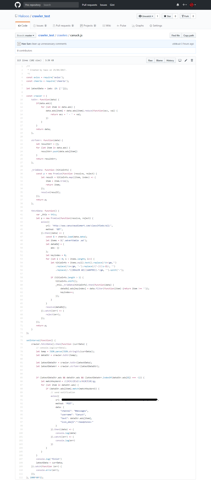

# Node爬虫和slack

slack 是一个新兴的事实通讯工具，前端使用的是React，桌面版本是用 electron 构建的，同时也有ios和安卓app。为什么说它好呢，因为开发者可以调用它提供的丰富的 API 来在自己的频道做很多有趣的事情。最近在做一个公司内部管理工具的时候用到了 slack 来发送项目的实时信息，比如版本变更，上线、部署通知等等。

言归正传，来说这个简单的 node 爬虫。这也是我写的第一个爬虫，主要目的是观测一个二手耳机交易的页面，如果有我想要的耳机型号就发一条通知到我自己的 slack 频道。因为手机上也安装了 slack，所以打开消息推送后我就可以随时收到有关这个耳机型号最新的交易信息。

代码如下：

爬虫的主要逻辑在 crawler.fetchData() 这个函数里。过程就是简单的请求页面（这里用的是 axios），然后 cheerio 解析 html 字符串。获取到表格信息后进行简单的字符串处理，最终返回一个 Object 包含我们需要的信息。

爬虫很简单，一颗赛艇的是后边的消息推送，功能很强大，代码很简单，这全得益于 slack（此条广告五毛钱）。后边的逻辑主要做的是每若干分钟（这里是2分钟）请求一次页面，拿最新的一条信息比对上一次查询到的广告（全局变量 latestData 存储的是上一次查询的结果），如果没有新的广告贴出来，就结束，如果有新的广告，就循环查看第一页所有的内容。找到我想要的关键字（matchKeyword），就通过一个 post 请求发一条推送到我的 slack 频道。这个 post 请求的 url 可以在 slack 的频道设置(channel setting) > add an app or integration > 搜索：Incoming WebHooks > add configuration 中设置，设置完成后 slack 便会生成这个 url。

完成后用 pm2 挂在自己的服务器上 全天候24小时监测，完美 :D

下边看一个关键字 (matchKeyWord) 为 jbl 的结果：

运行成功，接下来我就可以根据需求登录官网找到卖家进行交易了 /斜眼笑